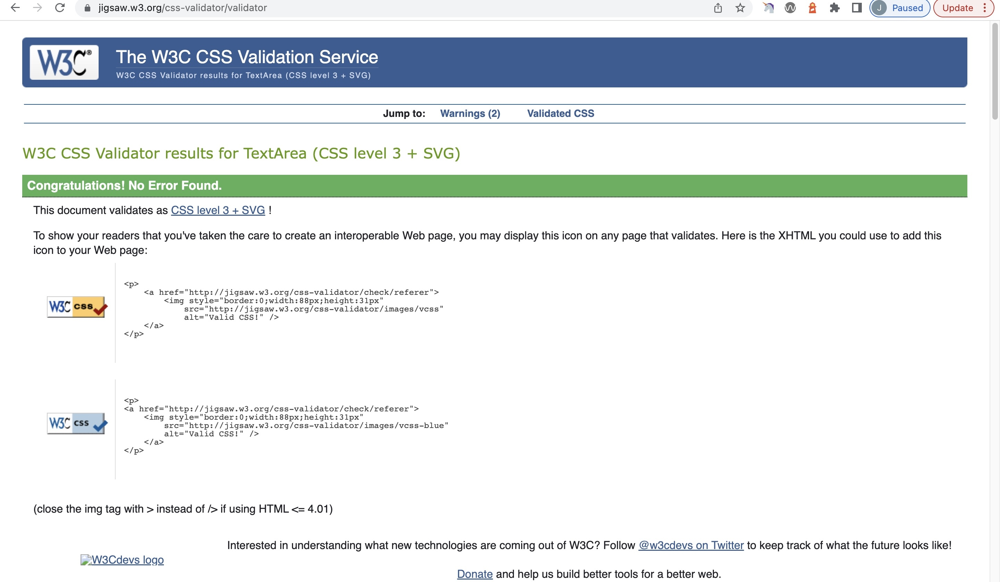

# IPCC AR6 Synthesis Report Quiz

The IPCC AR6 Synthesis Report Quiz has been created to test the user's knowledge based on the report findings, and will provide explanations and further depth to any understanding the user had on our current global warming status.
The quiz' main target market group includes both the public (average joe or jaspreet!), and those with knowledge in the sector currently: private sector, public sector, investors, scientists and activists, all working towards reducing gloabl warming. This target market group has such a huge varitety of typical users, and therefore the quiz has been designed for those with any level of knowledge. If a user doesn't have any context to the questions, then they can simply guess and recieve the correct answer and facts to boost their knowledge. For users that are already focussing work in the sctor, the quiz provides extra depth and controversial facts as to how we advance our efforts to reducing warming.

An ideal user would be members from product development in RnD across industry sectors, asset managers, policy makers, UN advisory group memebers and so forth; (typically those who have not read the report page to page) and in order to educate on the means neccessary to achieve, and in some way redirect our efforts, for reduction of gloabl warming.

## Features

### Wireframe

This is a basic format used to formalise a theory for the website. Ideas for the site are displayed here, including a suggestion for the transitition as the quiz progresses. Since creating the website, placement of the items and styling have been reconsidered.

### Flowchart planning

This is a basic structure for both html sections and javascript, and I produced this to run through the plan for the quiz. Breaking this down in to thoughts on each function, event listeners for my html buttons (onlclick), loops and conditional statements helped to simplify how I wrote out the javascript, each function step by step.

## Existing Features

## Quiz Bio

Featured on window load, hidden display once 'Test Your Self Here!' button is clicked by event listener.
Text explains the importance of the quiz and what the user should gain from testing their knowledge.
Unordered list and basic html format reduce when screen width is smaller.
This section allows the user to progress to the quiz.
At any point during the quiz, should a user refresh the page, it will bring you back to the start of the quiz.

## Footer

Fixed throughout, displays link to the IPCC AR6 report where a user can read in full, should they wish. Aria labelled accordingly.

## Quiz area

### Question

Selects relevant question from quiz array.

### Timer

Set to 20secs for every question. Text at timer id should result "done" when the timer is up, and the correct answer and explanation is shown.

### Select Option Buttons

Event listener added to check when the select option chosen is selected and check if this matches the correct answer.

### Current Score (Total Correct) and Questions Remaining

Implemented to either add 1 to the total correct if the question is answered correctly, and either way minus 1 to the quiz questions length.

### Relevant answer and explanation

Displays relevant answer and explanation when either timer runs out or when the user clicks on an option to answer.

### Final Result Takeaway

Sets a conditonal statement to notify the user if they scored 50% and above or less then 50%.

## Questions.js and explanatation.js

### Separate files

This quiz has two addtional files set up to store both the quiz dataset and explanations dataset. The quiz containts: question number, question, (correct) answer and all options. The explanation data set contains the question number and relevant explanation.
Due to the context of this quiz, the explanatation has been added to reveal more depth to the user's understanding and knowldge as a takeaway from the quiz.
Both the reveal answer and explanation are built to load simulatnouesly as the user selects their answer option for the question.

### Import, export and modules

Quiz from Questions.js and explanations from explanations.js are both exported and imported in to the script.js. Script.js has been listed as modules on HTML.

### Changing options length per question

The questions.js quiz dataset has a different number of options to select per question. Most online quiz examples use a basic format of four routine options, labelled with dataset 1 and so forth. This quiz uses code to create a button for each option per question.

### Mulitple true answers in javascript array

The questions.js quiz dataset has two unique questions 'numb 3' and 'numb 13'. Both of these questions are trick questions to the user, and have multple answers as the correct answer. Code has been written with an array of corrrect answers for each, then checked via a loop under the main function for reveal answer.

## Features left to implement

1. Nested questions inside a question in javascript. Ie. Q11 Part A..., Q11 Part B.... .
2. Graphs or assigned links to each explanation/ when answer revealled.
3. List of all sources with a button to release this - would be especially useful for any scientists, research and developemtn or product development users.
4. Option to pdf the questions and answers dataset.
5. Most arrays have been accessed using JSON dot notation, for more complex addtions to the quiz would use indexing.

## Design

- Background photo and basic colour scheme mirroring the IPCC Synthesis Report website:
  -

- Colour scheme worked around tints of #5493cd Blue:
  

- Complimentary tones of light grey and white used in fonts and div backgrounds to improve over all styling and readability.
- All elements have been centred to allow a common theme and easy scrolling / movement throughout the quiz for the user.
- Capitalised fonts and letter spacing have been used to increase contrast for readibilty where the background image is dark and text is light.

### Validator Testing

## HTML

- No errors found.
  

## CSS

- No errors found.
  

## Code Testing

- Incomplete tests. Only practiced tests on laptop chrome due to issues progressing the quiz and spent time on dev tools and testing to try and solve (unsuccesful).
  

## Media Response

- All elements are designed to adjust items in to a column as media devices get smaller.
- All headings, paragraph text, the footer, and specialised ids have been reduced to 90% as the screen size is reduced.

Examples:

## Lighthouse

## Wave

- No errors or contrast errors on all pages
- There were contrast errors due to the light text colour (white) and the dark background image. In order to eliminate contrast errors, background opacity has been set per divided section to provide a more fluid readability.
- Some divs have increased opcacity with background lighter opacity in order to highlight some sections (ie. the question section).

### Solved Bugs

### Unsolved Bugs

## Deployment

- The site was deployed to GitHub pages.
  The live link can be found here - "https://jodiehillkitcherside.github.io/project2-ipcc-ar6-quiz/"

## Credits

### Inspired websites and tutor/mentor suggestions

- [Stackoverflow - Loop options and questions](https://stackoverflow.com/questions/66765795/for-loops-for-multiple-choice-questions) taught me how to create a loop to extract options and questions.
- [Stackoverflow - Timer](https://stackoverflow.com/questions/44314897/javascript-timer-for-a-quiz) taught me how to create a timer.
- [Stackoverflow - Window Onload](https://stackoverflow.com/questions/39307329/hide-div-onload-in-javascript) taught me how to reset the quiz and postion my elements on load of the browser.
- [Stackoverflow - Multiple true answers](https://stackoverflow.com/questions/19384915/multiple-true-answers-in-javascript-array-prompt) taught me how to check and validate multiple true answers.
- [GeeksforGeeks - Accessing nested object arrays](https://www.geeksforgeeks.org/how-to-access-and-process-nested-objects-arrays-or-json/) taught me how to use dot notation to access quiz.js object arrays.
- [Viewport width and height to cover screen](https://dev.to/lennythedev/css-gotcha-how-to-fill-page-with-a-div-270j) taught me how to make my image fill the screen.
- [Footer](https://www.freecodecamp.org/news/how-to-keep-your-footer-where-it-belongs-59c6aa05c59c/) taught me how to postion fotter to the very bottom despite the content fit.
- Tutor Ed helped me identify how to change the x-index of elements layered on the screen and setting an event listener for the DOM.
- Tutor Sean helped me massively rewrite a function to aply to other functions, where before I had written the wrong instructions to display question.
- Sean Young_Hackteam helped me greatly understand the import, export and modules with separate files for js. I also used [JS Guide Modules](https://developer.mozilla.org/en-US/docs/Web/JavaScript/Guide/Modules).
- [Reminder to iterate through nesteded arrays](https://stackoverflow.com/questions/43695026/iterate-through-an-array-one-at-the-time-for-a-quiz_

### Content

- All quiz quesitons, multiple choice answers, correct answers and explanations taken from [IPCC AR6 Synthesis Report Policy Makers Summary](https://www.ipcc.ch/report/ar6/syr/downloads/report/IPCC_AR6_SYR_SPM.pdf)
- No preauthorisation from the IPCC for the project given, the project this is for non-commercial use.
- No API used to form questions, all researched and created by myself.
- Bio text and takeaway written by myself, with context to the report and current industry I work in. You can see more about the company I currently work for here: [Climate Action](https://www.climateaction.org/)

### Media

- Background image sourced directly from the IPCC Article AR6 Synthesis Report landing page.

### Inspiration

- The IPCC AR6 Synthesis Longer Report is 85 pages in itself and 34 pages in the Policy Makers Summary, of which this quiz is based off of the figures and report findings.
  The average user will either not have heard of this report, or would not have had the chance to read all of it in detail.
  There are numerous articles which summarise big findings, but again most of which would have only been read by those who know about the report and work closely to the research within the industry.
  This quiz website is inspired based on the lack of educatation for the general user and can be played by any user.
  You can see snippets of the report I read to create the quiz here:
  
